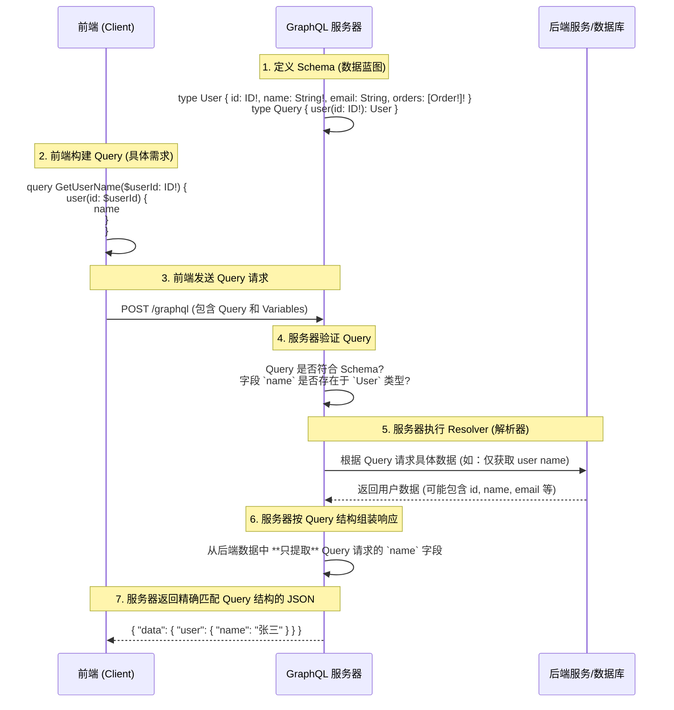
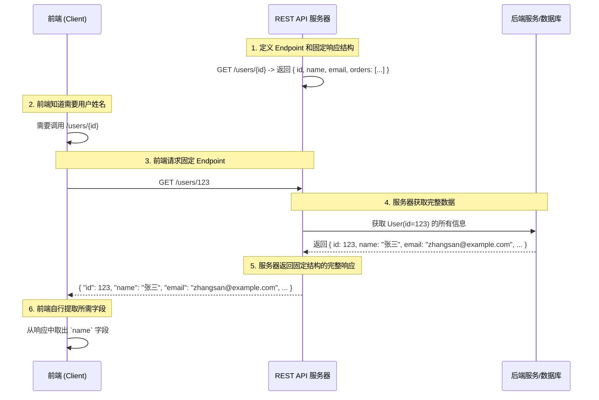

---
{"dg-publish":true,"permalink":"/GraphQL_核心概念_对比REST API/"}
---

- **TS Interface/Type**: 主要用于**编译时**的静态类型检查，描述**已知**的数据结构。它是开发语言层面的工具。
- **GraphQL Schema**: 是**API 层面的契约**，定义了**整个数据交互的可能性边界**。它不仅用于类型检查，更是 GraphQL 查询验证、执行、网络传输和工具生态（如 GraphiQL、代码生成）的**核心驱动力**。它改变了客户端与服务端**交互的方式**。

所以，虽然它们都涉及“类型定义”，但 GraphQL Schema 提供了一个更强大、更灵活、类型更安全的 **API 交互模型**，而不仅仅是静态的数据结构描述。

#review 

---

## GraphQL 的工作流程 (精确版)

**关键点解读:**

1.  **后端定义的是 Schema (类型系统)**： 这是所有 *可能* 被查询的数据的蓝图和规则。它定义了有哪些类型 (如 `User`, `Product`)，每个类型有哪些字段 (如 `id`, `name`, `price`)，以及类型之间的关系 (如 `User` 有 `orders`)。这比 REST 中的“接口定义”更结构化和全面。
2.  **前端定义的是 Query (查询)**： 前端根据业务需求，从 Schema 中选择它 *当前* 需要的字段和关系，构成一个结构化的查询语句。这 **不是** 定义一个新的接口，而是像对数据库写 SQL 查询一样，声明需要什么数据。
3.  **后端执行并精确响应**： GraphQL 服务器接收到查询后：
    *   **验证 (Validation)**：对照 Schema 检查查询是否合法（类型、字段是否存在，参数是否正确）。
    *   **执行 (Execution)**：调用对应的解析器 (Resolver) 函数去获取数据。解析器知道如何从数据库或其他服务获取单个字段的数据。
    *   **过滤与塑形 (Filtering & Shaping)**：**最关键的一步！** 即使后端服务返回了完整的数据对象（比如整个 User 对象），GraphQL 服务器也会严格按照前端 Query 的结构，**只挑选出被请求的字段** (`name`)，然后组装成与 Query 结构完全一致的 JSON 返回给前端。

---

## 对比传统 REST API

**REST 的区别:**

1.  **固定响应**: 后端定义了每个接口 (`/users/123`) 返回的固定数据结构。
2.  **前端被动接收**: 前端只能请求这个接口，然后接收后端给的所有数据。
3.  **过量/不足获取 (Over/Under-fetching)**:
    *   **Over-fetching**: 前端只需要 `name`，但后端返回了 `id`, `name`, `email` 等，浪费带宽。
    *   **Under-fetching**: 如果前端还需要用户的订单列表，它可能需要再调用另一个接口，如 `/users/123/orders`，导致多次网络请求。
4.  **前端提取**: 前端需要从收到的完整数据中自己挑出需要的部分。

---

## 总结

*   你说的“后端定义完成的接口”在 GraphQL 中对应 **Schema 定义**，这是一个更强大的、描述所有数据可能性的蓝图。
*   你说的“前端就是只定义需要的接口”在 GraphQL 中对应 **前端构建 Query**，这是一个精确描述单次请求所需数据的声明。
*   GraphQL 的核心优势在于，这个 **Query 直接驱动了后端的数据获取和响应塑形**，保证了返回的数据不多不少，正好是前端请求的结构，避免了 REST 常见的 Over/Under-fetching 问题，并减少了网络请求次数。

所以，虽然结果看起来相似（前端拿到需要的数据），但实现机制和带来的好处（效率、灵活性、强类型契约）是 GraphQL Schema 独有的。它不是简单地让后端根据前端的“接口定义”返回数据，而是提供了一套语言和引擎让前端能够精确声明需求，后端据此精确执行。