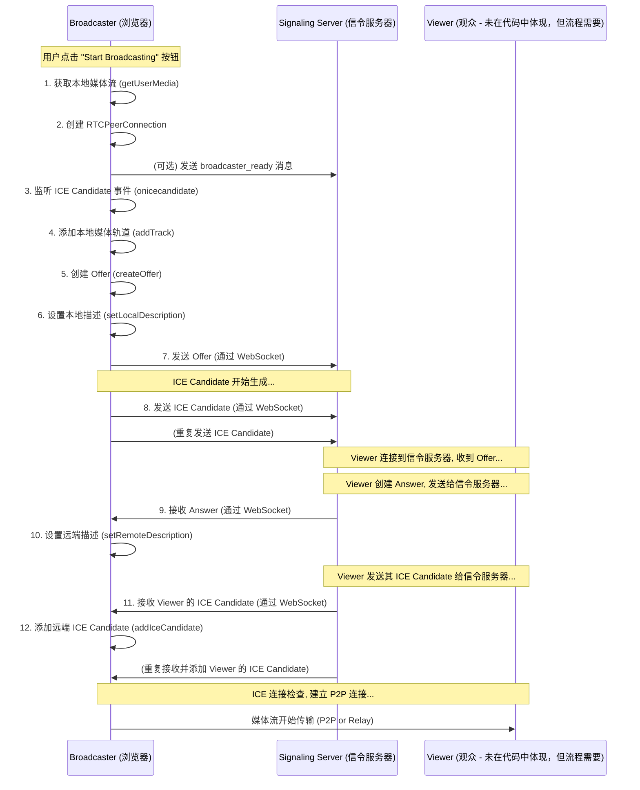

---
{"dg-publish":true,"permalink":"/浏览器_API_webRTC_原理和代码解析/"}
---

#review 


在深入代码细节之前，我们先用 Mermaid 图梳理一下主播端（Broadcaster）发起连接的主要流程：



---

### 代码与 WebRTC 原理对应解析

#### 1. 初始化和准备工作

```javascript
// HTML Elements
const localVideo = document.getElementById('localVideo');
const startButton = document.getElementById('startButton');
// Signaling Server Connection
const ws = new WebSocket('ws://localhost:8080'); // 连接信令服务器
// WebRTC Variables
let localStream;
let peerConnection;
let iceCandidateBuffer = []; // 用于缓存 ICE Candidate
// ICE Server Configuration
const configuration = { iceServers: [{ urls: 'stun:stun.l.google.com:19302' }] };

ws.onopen = () => console.log('Connected to signaling server');
ws.onerror = (error) => console.error('WebSocket Error:', error);
// ... (ws.onmessage will be detailed later)
startButton.onclick = startBroadcasting;
```

*   **WebRTC 原理:**
    *   **信令 (Signaling):** WebRTC 本身不负责信令传输。你需要一个“带外”（out-of-band）机制来交换连接所需的元数据（SDP Offer/Answer, ICE Candidates）。这里使用 WebSocket (`ws`) 作为信令通道。
    *   **NAT 穿透 (ICE Framework - STUN/TURN):** `configuration` 定义了 ICE 服务器。`stun:stun.l.google.com:19302` 是一个公共 STUN 服务器。STUN (Session Traversal Utilities for NAT) 用于帮助设备发现其在公共网络上的 IP 地址和端口，这是建立 P2P 连接的第一步，尤其当设备位于 NAT 路由器后面时。
*   **我的业务场景:**
    *   我需要一个界面 (`<video>`, `<button>`) 让主播看到自己的画面并开始直播。
    *   我必须先连接上一个“中间人”（信令服务器），这个服务器不处理音视频数据，但它负责帮我和观众“牵线搭桥”，交换建立连接所需的信息。就像打电话前需要知道对方的号码一样，这个服务器就是帮我们交换“号码”（连接信息）的地方。
    *   大部分用户都在家庭或公司网络里，直接访问外网IP比较困难。我需要 STUN 服务器帮我探测一下，我对外暴露的“地址”是什么，这样观众才可能直接找到我。如果 STUN 不行，更复杂的场景可能还需要 TURN 服务器（代码中未配置）进行数据中继。
*   **实际网站例子:** 任何需要实时通信的 Web 应用，如 Google Meet、Discord 网页版、腾讯会议 Web 版，背后都有信令服务器（协议可能是 WebSocket、XMPP 或自定义的）和 STUN/TURN 服务器配置。
*   **关联知识点:** WebSocket API、NAT (Network Address Translation)、STUN、TURN、ICE (Interactive Connectivity Establishment) 框架。`iceCandidateBuffer` 用于处理 ICE 候选者可能比 Answer 先到达的异步问题（稍后详述）。

#### 2. 开始广播 (`startBroadcasting` 函数)

```javascript
const startBroadcasting = async () => {
    startButton.disabled = true;
    console.log('Starting broadcast...');

    try {
        // 1. 获取本地媒体流
        localStream = await navigator.mediaDevices.getUserMedia({ video: true, audio: true });
        localVideo.srcObject = localStream;
        console.log('Local stream obtained');

        // (Optional) Notify server
        ws.send(JSON.stringify({ type: 'broadcaster_ready' }));

        // 2. 创建 PeerConnection
        peerConnection = new RTCPeerConnection(configuration);
        console.log('PeerConnection created');
        // ... (event listeners and rest of the steps)
    } catch (error) {
        // ... error handling
    }
};
```

*   **WebRTC 原理:**
    *   **媒体捕获 (Media Capture):** `navigator.mediaDevices.getUserMedia()` 是 Web API，用于请求访问用户的摄像头和麦克风权限，并获取包含音视频轨道的 `MediaStream` 对象。
    *   **核心连接对象 (RTCPeerConnection):** `new RTCPeerConnection(configuration)` 创建了 WebRTC 连接的核心实例。它管理着整个连接的生命周期，包括媒体协商、ICE 过程、数据传输等。`configuration` 在这里传入了 STUN 服务器信息。
*   **我的业务场景:**
    *   点击“开始直播”后，我首先要让浏览器问我：“这个网站想用你的摄像头和麦克风，同意吗？”。我同意后，浏览器就把摄像头画面 (`video: true`) 和麦克风声音 (`audio: true`) 捕获到，并在页面上的 `localVideo` 元素里预览给我看 (`localVideo.srcObject = localStream`)。
    *   同时，我需要初始化一个“连接器” (`RTCPeerConnection`)，告诉它用哪个 STUN 服务器来帮助打洞。这个“连接器”就是未来负责跟观众建立直接联系的“管道”的本地端口。
*   **实际网站例子:** 在视频会议软件中点击“开始视频/加入会议”时，会触发类似 `getUserMedia` 的操作获取权限和媒体流。后台则会创建 `RTCPeerConnection` 准备连接。
*   **关联知识点:** MediaStream API, Permissions API, `RTCPeerConnection` API, `RTCConfiguration`。

#### 3. 处理 ICE Candidate

```javascript
        // 3. 监听 ICE Candidate 事件
        peerConnection.onicecandidate = event => {
            if (event.candidate) {
                console.log('Sending ICE candidate:', event.candidate);
                // 通过 WebSocket 发送 Candidate
                ws.send(JSON.stringify({ candidate: event.candidate }));
            }
        };
```

*   **WebRTC 原理:**
    *   **ICE Candidate 收集与交换:** `onicecandidate` 事件处理器会在 ICE 代理（浏览器底层）找到一个潜在的连接路径（本地 IP、STUN 获取的公网 IP/端口、TURN 服务器中继地址）时触发。每个路径就是一个 `RTCIceCandidate` 对象。这些 Candidate 必须通过信令服务器发送给对方。这个过程称为 Trickle ICE（候选者一产生就发送，而不是等所有都收集完）。
*   **我的业务场景:**
    *   创建好 `RTCPeerConnection` 并设置了本地描述（后面会讲）之后，浏览器就开始“探索”所有能让观众联系到我的网络路径。比如，它发现我的电脑局域网 IP 是 `192.168.1.100:5000`，通过 STUN 服务器发现我的公网 IP 是 `123.45.67.89:9000` 等等。每找到一个可能的路径（Candidate），我就要立刻通过 WebSocket 告诉信令服务器，让它转发给观众。观众也做同样的事情，把他们的 Candidate 发给我。
*   **实际网站例子:** 视频通话建立过程中的“正在连接...”状态，通常就是双方在通过信令服务器疯狂交换 ICE Candidate，并尝试进行连通性检查。
*   **关联知识点:** ICE (Interactive Connectivity Establishment), `RTCIceCandidate` object, Trickle ICE, Signaling.

#### 4. 添加媒体轨道

```javascript
        // 4. 将本地流轨道添加到 PeerConnection
        localStream.getTracks().forEach(track => {
            peerConnection.addTrack(track, localStream);
            console.log('Added local track:', track.kind);
        });
```

*   **WebRTC 原理:**
    *   **媒体流关联:** `addTrack(track, stream)` 方法将之前 `getUserMedia` 获取到的 `MediaStream` 中的每个轨道（`MediaStreamTrack`，通常一个是视频，一个是音频）添加到 `RTCPeerConnection` 中。这告诉连接：“当连接建立后，请把这些轨道的数据发送给对方”。
*   **我的业务场景:**
    *   我已经拿到了摄像头画面和麦克风声音（`localStream`），现在需要明确告诉那个“连接器” (`peerConnection`)：“嘿，等会儿连接通了，记得把这个视频轨道和这个音频轨道的数据传输出去！”
*   **实际网站例子:** 在视频会议中打开/关闭自己的摄像头或麦克风，实际上就是在对应的 `RTCPeerConnection` 上调用 `addTrack` 或 `removeTrack` (或者通过 `RTCRtpSender.replaceTrack` 替换为空轨道)。
*   **关联知识点:** `MediaStream`, `MediaStreamTrack`, `RTCPeerConnection.addTrack()`, `RTCRtpSender` (addTrack 返回的对象，可用于控制发送)。

#### 5. 创建并发送 Offer

```javascript
        // 5. 创建 SDP Offer
        const offer = await peerConnection.createOffer();
        // 6. 设置本地描述 (setLocalDescription)
        await peerConnection.setLocalDescription(offer);
        console.log('Local description set (offer)');

        // 7. 通过 WebSocket 发送 Offer
        console.log('Sending offer:', offer);
        ws.send(JSON.stringify({ offer: offer }));
```

*   **WebRTC 原理:**
    *   **SDP (Session Description Protocol) Offer/Answer 模型:** WebRTC 使用 SDP 来描述多媒体会话的参数。发起方（这里是广播者）创建 Offer，其中包含了它支持的音视频编解码器 (Codecs)、安全参数 (DTLS) 以及它已经收集到的 ICE Candidates (通常是初始的一部分)。
    *   **`createOffer()`:** 生成 SDP Offer。
    *   **`setLocalDescription(offer)`:** 将生成的 Offer 应用到本地 `RTCPeerConnection`。这会正式启动 ICE 代理收集 Candidate 的过程（`onicecandidate` 开始密集触发）。
    *   **信令传输 Offer:** 将 Offer 序列化（通常是 JSON）并通过信令服务器发送给对方（观众）。
*   **我的业务场景:**
    *   现在我要正式向观众“提议”建立连接了。我生成一个“提议书”（Offer），里面写明：“我能提供 H.264 视频和 Opus 音频，这是我的联系方式（初始 Candidate），我们用 DTLS 加密通信吧”。
    *   我先在本地“备案”这个提议（`setLocalDescription`），然后把这份“提议书”通过 WebSocket 发给信令服务器，让它转交给想看我直播的观众。
*   **实际网站例子:** 当你发起一个视频通话时，你的浏览器会执行 `createOffer`, `setLocalDescription`, 然后通过信令把 Offer 发送给对方。
*   **关联知识点:** SDP (Session Description Protocol), Offer/Answer Model, `RTCSessionDescription` object (Offer 和 Answer 都是这个类型), Codec Negotiation, DTLS (Datagram Transport Layer Security)。

#### 6. 处理来自信令服务器的消息 (`ws.onmessage`)

```javascript
ws.onmessage = async (event) => {
    const message = JSON.parse(event.data);
    console.log('Received message:', message);

    if (message.answer) { // 9. 接收 Answer
        if (!peerConnection) { /* ... */ return; }
        try {
            // 10. 设置远端描述
            await peerConnection.setRemoteDescription(new RTCSessionDescription(message.answer));
            console.log('Remote description set (answer)');

            // 处理缓存的 Candidate
            console.log(`Processing ${iceCandidateBuffer.length} buffered ICE candidates.`);
            while(iceCandidateBuffer.length > 0) {
                const candidate = iceCandidateBuffer.shift();
                try {
                    // 12. 添加远端 ICE Candidate (处理缓存)
                    await peerConnection.addIceCandidate(candidate);
                    console.log('Added buffered ICE candidate');
                } catch (error) { /* ... */ }
            }
        } catch (error) { /* ... */ }
    } else if (message.candidate) { // 11. 接收 Viewer 的 ICE Candidate
         if (!peerConnection || !peerConnection.remoteDescription) {
            console.warn("PeerConnection not ready for ICE candidate or remote description not set yet.");
            // 缓存 Candidate，因为 remoteDescription 必须先设置
            iceCandidateBuffer.push(new RTCIceCandidate(message.candidate));
            console.log('Buffered received ICE candidate');
            return; // 注意：原代码这里直接 return 了，更好的做法是缓存
         }
        try {
            const candidate = new RTCIceCandidate(message.candidate);
            if (peerConnection.remoteDescription) { // 确保 remoteDescription 已设置
                // 12. 添加远端 ICE Candidate (直接添加)
                await peerConnection.addIceCandidate(candidate);
                console.log('Added received ICE candidate directly');
            } else {
                // 再次检查并缓存 (理论上上面的 if 会先处理)
                iceCandidateBuffer.push(candidate);
                console.log('Buffered received ICE candidate');
            }
        } catch (error) { /* ... */ }
    } else if (message.type === 'viewer_ready') {
         // ... (这个是应用层逻辑，表示有观众准备好了)
    }
};
```

*   **WebRTC 原理:**
    *   **接收 Answer:** 对方（观众）收到 Offer 后，会生成一个 Answer（同样是 SDP），表明它同意使用的编解码器、它的安全参数和它的 ICE Candidates。这个 Answer 通过信令服务器传回给广播者。
    *   **`setRemoteDescription(answer)`:** 广播者收到 Answer 后，将其应用到 `RTCPeerConnection`。此时，双方就媒体格式、安全等达成一致。浏览器知道了对方的“配置”。
    *   **接收并添加远端 ICE Candidate:** 对方也会通过信令服务器发送它的 ICE Candidates。广播者收到后，调用 `peerConnection.addIceCandidate(candidate)` 将这些 Candidate 提供给本地 ICE 代理。
    *   **ICE Candidate 缓冲:** `addIceCandidate` 必须在 `setRemoteDescription` 之后调用。但由于信令是异步的，远端的 Candidate 可能比 Answer 先到达。因此，代码中加入了 `iceCandidateBuffer`：如果收到 Candidate 时 `remoteDescription` 还没设置好，就先存起来 (`iceCandidateBuffer.push`)；等 `setRemoteDescription` 成功后再把缓存的 Candidate 逐一添加 (`while` 循环处理 `iceCandidateBuffer`)。这是处理异步竞争条件的关键。
*   **我的业务场景:**
    *   我发出的“提议书”（Offer）被观众收到了。观众回复了一封“回执”（Answer），说：“同意你的提议，这是我的联系方式（观众的 Candidate）”。我收到这份“回执”后，在本地“更新状态”（`setRemoteDescription`），表明我知道了观众那边的情况。
    *   同时，观众也在不断地把他们的网络路径信息（Candidate）发给我。我收到一个就记录一个（`addIceCandidate`）。
    *   **关键的缓冲逻辑：** 有时候观众的“联系方式”（Candidate）可能比“回执”（Answer）先到。如果我还没看到“回执”就尝试记录“联系方式”，浏览器会报错。所以，我得先把这些早到的“联系方式”放在一个“暂存区”（`iceCandidateBuffer`），等收到并处理完“回执”后，再把“暂存区”里的“联系方式”拿出来正式记录。
*   **实际网站例子:** 视频通话能成功建立，就是因为双方正确地交换了 Offer/Answer 并互相添加了对方的 ICE Candidates，最终浏览器通过这些信息找到了最佳的 P2P（或经由 TURN 中继）路径。
*   **关联知识点:** SDP Offer/Answer Model, `RTCSessionDescription`, `RTCIceCandidate`, `peerConnection.setRemoteDescription()`, `peerConnection.addIceCandidate()`, Asynchronous programming, Race conditions, ICE Connectivity Checks (由浏览器在添加 Candidate 后自动进行)。

---

### 总结与扩展

这段代码完整地演示了 WebRTC 广播者（发起方）的核心流程：

1.  **媒体获取:** 拿到要传输的内容。
2.  **PeerConnection 创建:** 准备好连接对象，并配置 NAT 穿透。
3.  **信令交互:**
    *   创建并发送 Offer (SDP)。
    *   持续发送本地 ICE Candidates。
    *   接收并处理 Answer (SDP)。
    *   接收并处理远端 ICE Candidates (注意缓冲)。
4.  **媒体关联:** 将本地媒体轨道附加到连接上。

一旦 `setLocalDescription` 和 `setRemoteDescription` 都完成，并且双方交换了足够的 ICE Candidates，浏览器底层的 ICE 代理就会进行**连通性检查 (Connectivity Checks)**，尝试在各种 Candidate 对之间发送 STUN 请求，找到一条能打通的路径。一旦找到可用路径，`RTCPeerConnection` 的状态会变为 `connected`，媒体流（`addTrack` 添加的那些）就会开始通过这条路径传输给对方。

**需要注意的几点:**

*   **Viewer 端代码:** 这段代码只有 Broadcaster。一个完整的系统还需要 Viewer 端的代码，逻辑上是镜像的：接收 Offer -> 创建 Answer -> `setLocalDescription(answer)` -> 发送 Answer -> `setRemoteDescription(offer)` -> 交换 ICE Candidates。
*   **信令服务器实现:** 代码只展示了客户端如何使用 WebSocket。你需要一个实际运行的 WebSocket 服务器（比如用 Node.js 的 `ws` 库实现）来接收和转发这些信令消息。服务器需要逻辑来匹配 Broadcaster 和 Viewer。
*   **错误处理:** 实际应用需要更健壮的错误处理。
*   **多观众场景:** 这个基础模型是一对一的。对于一对多直播，通常不会让主播与每个观众都建立单独的 P2P 连接（性能开销大）。更常见的架构是使用 **SFU (Selective Forwarding Unit)** 或 **MCU (Multipoint Conferencing Unit)** 服务器。主播只向 SFU/MCU 发送一路流，服务器再将流转发给所有观众。但这会增加服务器成本和复杂度。
*   **Data Channels:** WebRTC 不仅能传音视频，还能通过 `RTCDataChannel` 传输任意数据，可以用来做聊天、文件传输等。

希望这个结合原理、场景、例子和关联知识点的分析，能让你更透彻地理解这段 WebRTC 代码的设计思路！