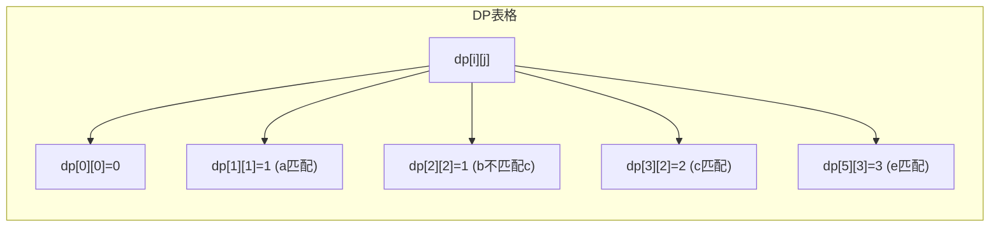

---
{"dg-publish":true,"permalink":"/算法_动态规划_最长公共子序列/"}
---

#review  
# 最长公共子序列问题解析

## 问题理解

最长公共子序列(LCS)问题要求我们找出两个字符串中最长的共同子序列的长度。子序列是指从原字符串中可以通过删除某些字符（不改变剩余字符顺序）得到的新字符串。


## 解题思路

这是一个经典的动态规划问题，我们可以通过构建一个二维表格来解决:

1. 创建一个 `(m+1)×(n+1)` 的二维数组 `dp`，其中 `m` 和 `n` 分别是两个字符串的长度
2. `dp[i][j]` 表示 `text1` 的前 `i` 个字符和 `text2` 的前 `j` 个字符的最长公共子序列长度
3. 状态转移方程:
   - 如果 `text1[i-1] == text2[j-1]`，则 `dp[i][j] = dp[i-1][j-1] + 1`
   - 否则，`dp[i][j] = Math.max(dp[i-1][j], dp[i][j-1])`

## 图解动态规划过程

以示例1中 `text1 = "abcde"` 和 `text2 = "ace"` 为例:



## JavaScript 解决方案

```javascript
/**
 * 求两个字符串的最长公共子序列长度
 * @param {string} text1
 * @param {string} text2
 * @return {number}
 */
var longestCommonSubsequence = function(text1, text2) {
    // 获取字符串长度
    const m = text1.length;
    const n = text2.length;
  
    // 创建一个 (m+1)×(n+1) 的二维数组作为DP表格
    // dp[i][j] 表示 text1 前 i 个字符和 text2 前 j 个字符的最长公共子序列长度
    const dp = Array(m + 1).fill().map(() => Array(n + 1).fill(0));
  
    // 填充DP表格
    for (let i = 1; i <= m; i++) {
        for (let j = 1; j <= n; j++) {
            // 如果当前字符匹配，则在之前的最长公共子序列基础上加1
            if (text1[i - 1] === text2[j - 1]) {
                dp[i][j] = dp[i - 1][j - 1] + 1;
            } else {
                // 否则，取两种情况的最大值
                // 1. 排除text1当前字符的最长公共子序列
                // 2. 排除text2当前字符的最长公共子序列
                dp[i][j] = Math.max(dp[i - 1][j], dp[i][j - 1]);
            }
        }
    }
  
    // 返回最终结果，即text1和text2的最长公共子序列长度
    return dp[m][n];
};
```

## 例子详解

来看一下示例1的详细执行过程:

**输入:** `text1 = "abcde"`, `text2 = "ace"`

**初始状态:** 

DP表格初始化后所有值为0:
```
   | '' | a | c | e
---+----+---+---+---
'' | 0  | 0 | 0 | 0
---+----+---+---+---
a  | 0  | ? | ? | ?
---+----+---+---+---
b  | 0  | ? | ? | ?
---+----+---+---+---
c  | 0  | ? | ? | ?
---+----+---+---+---
d  | 0  | ? | ? | ?
---+----+---+---+---
e  | 0  | ? | ? | ?
```

**填充过程:**

1. `i=1, j=1`: `text1[0] = 'a'` 与 `text2[0] = 'a'` 相等，所以 `dp[1][1] = dp[0][0] + 1 = 1`
2. `i=1, j=2`: `text1[0] = 'a'` 与 `text2[1] = 'c'` 不相等，所以 `dp[1][2] = max(dp[0][2], dp[1][1]) = max(0, 1) = 1`
3. ...以此类推

**最终的DP表格:**
```
   | '' | a | c | e
---+----+---+---+---
'' | 0  | 0 | 0 | 0
---+----+---+---+---
a  | 0  | 1 | 1 | 1
---+----+---+---+---
b  | 0  | 1 | 1 | 1
---+----+---+---+---
c  | 0  | 1 | 2 | 2
---+----+---+---+---
d  | 0  | 1 | 2 | 2
---+----+---+---+---
e  | 0  | 1 | 2 | 3
```

因此，答案是 `dp[5][3] = 3`，最长公共子序列是 "ace"。

## 复杂度分析

- **时间复杂度:** O(m×n)，其中m和n是两个字符串的长度，需要填充整个dp表格
- **空间复杂度:** O(m×n)，需要存储整个dp表格

这是一个经典的动态规划解法，清晰易懂且高效。