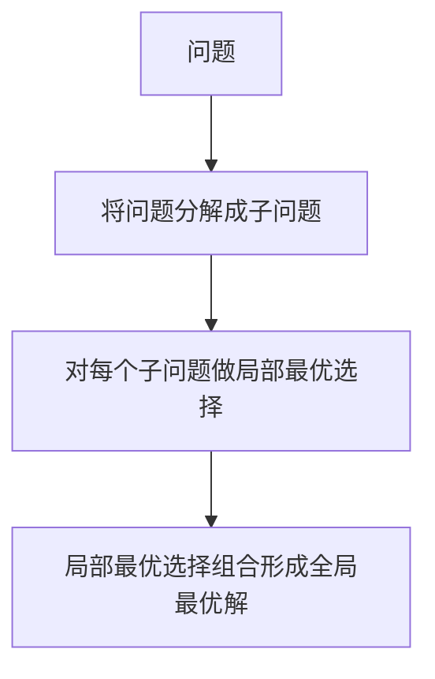
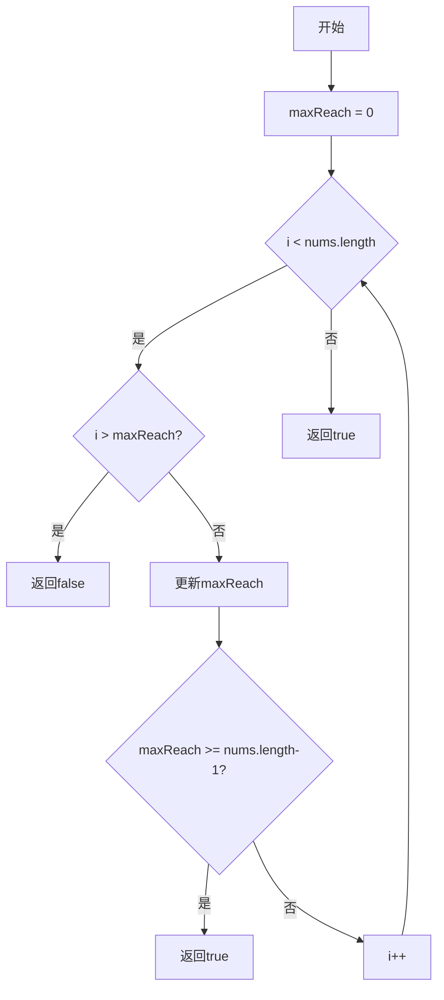

---
{"dg-publish":true,"permalink":"/算法_贪心/"}
---


# 贪心算法学习指南

贪心算法是解决优化问题的一种强大方法，它的核心思想是在每一步选择中都
采取在当前状态下看起来最好的选择，从而希望导致全局最优解。

==优先满足最容易满足的 且用最小的代价==

## 贪心算法的核心思想



## 贪心算法的特点

1. **贪心选择性质**：每一步的局部最优选择能导致全局最优解
2. **最优子结构**：问题的最优解包含子问题的最优解
3. **简单高效**：实现简单，执行效率通常较高
4. **不回退**：一旦做出选择，不会回退重新考虑

## 力扣贪心算法题目清单（由易到难）

### 入门级题目
[[算法_贪心_分发饼干\|算法_贪心_分发饼干]]

[[算法_贪心_柠檬水找零\|算法_贪心_柠檬水找零]]

### 基础题目
[[算法_贪心_可达性作为局部最优解\|算法_贪心_可达性作为局部最优解]]

5. **[122. 买卖股票的最佳时机 II](https://leetcode.cn/problems/best-time-to-buy-and-sell-stock-ii/)**
   - 思路：只要今天价格比明天低，就可以买入卖出获利

[[算法_贪心_可达性作为局部最优解\|算法_贪心_可达性作为局部最优解]]

### 进阶题目


[[算法_贪心_数据关系_量身高_矮的人进入队列不会影响高的人\|算法_贪心_数据关系_量身高_矮的人进入队列不会影响高的人]]

9. **[56. 合并区间](https://leetcode.cn/problems/merge-intervals/)**
   - 思路：按区间起点排序，然后逐一合并重叠区间

### 高级题目
10. **[135. 分发糖果](https://leetcode.cn/problems/candy/)**
    - 思路：先从左到右遍历确保评分高的比右边多，再从右到左遍历确保评分高的比左边多

11. **[435. 无重叠区间](https://leetcode.cn/problems/non-overlapping-intervals/)**
    - 思路：按区间结束时间排序，贪心选择结束早的区间

12. **[452. 用最少数量的箭引爆气球](https://leetcode.cn/problems/minimum-number-of-arrows-to-burst-balloons/)**
    - 思路：按气球右边界排序，从左到右射箭

## 示例：跳跃游戏解析

### 问题描述
给定一个非负整数数组，你最初位于数组的第一个位置。数组中的每个元素代表你在该位置可以跳跃的最大长度。判断你是否能够到达最后一个位置。

### 贪心思路
```javascript
/**
 * @param {number[]} nums
 * @return {boolean}
 */
var canJump = function(nums) {
    // 维护最远可到达位置
    let maxReach = 0;
  
    for (let i = 0; i < nums.length; i++) {
        // 如果当前位置已经超出了最远可到达位置，返回false
        if (i > maxReach) return false;
      
        // 更新最远可到达位置
        maxReach = Math.max(maxReach, i + nums[i]);
      
        // 如果已经可以到达最后位置，返回true
        if (maxReach >= nums.length - 1) return true;
    }
  
    return true;
};
```

### 算法流程图


## 学习贪心算法的建议
1. **掌握基础题型**：从简单题目开始，理解贪心的基本应用
2. **证明贪心策略**：思考为什么局部最优能导致全局最优
3. **结合排序**：很多贪心问题需要先对数据排序
4. **寻找贪心标准**：找到正确的贪心选择标准是关键
5. **多做练习**：不同类型的贪心问题有不同的思路

## 扩展知识
- 贪心算法通常比动态规划更高效，但适用范围更窄
- 有些问题看似可以用贪心解决，但实际需要动态规划或其他方法
- 贪心算法在区间问题、调度问题和部分图论问题中应用广泛
- 推荐阅读：[贪心算法总结](https://leetcode.cn/circle/article/GXWYg7/)

希望这份指南能帮助你逐步掌握贪心算法的思路和应用！

**关键点：**

- **不是“大一点点”而是“最小可行”**：算法并不是主动去找“刚好大一点点”的饼干，而是按照排序顺序，使用第一个（也就是尺寸最小的那个）**满足条件 (`>=`)** 的饼干。
- **局部决策服务于全局目标**：每一步的贪心决策（用最小可行饼干满足最不贪心孩子）都是为了**保留更多（更大）的可能性**给后续的孩子。通过这种方式，我们确保不会因为过早地用掉大饼干而导致后面本可以满足的孩子无法被满足。这种“优先满足易满足者，且用最小代价满足”的策略，最终导向了全局满足数量的最大化。
- **不是所有孩子都用“大一点点”**：全局最优的结果是满足的孩子数量最多，但不一定意味着每个被满足的孩子都恰好分配到了比他胃口“大一点点”的饼干。有些孩子可能分到远大于他胃口的饼干（如果那是当时最小的可行选择），而有些孩子可能根本没分到饼干。